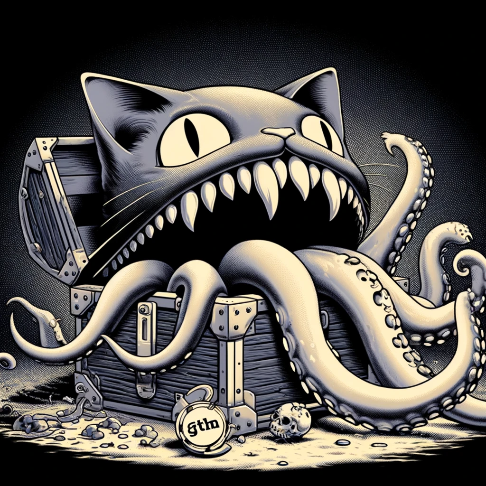

# 

[![GoDoc Widget]][GoDoc]

MMC is a box that acts like a cannibal, similar to a mimic (FUNNY)! 

Most of the treasures/monsters that are in the box are 'FP'. It may not be faster, but it will make the flow clearer.
## Features

* **Options** A simpler way to build the OPTION FUNCTION
* **KV** A struct resembling an element of a map (key, value)
* **Group** Simplifying the construction of the 'group by' function

## License

Copyright (c) 2024-present [denominator0](https://github.com/denominator0)

Licensed under [MIT License](./LICENSE)

[GODoc]: https://pkg.go.dev/github.com/denominator0/mmc
[GoDoc Widget]: https://pkg.go.dev/badge/github.com/denominator0/mmc?utm_source=godoc
